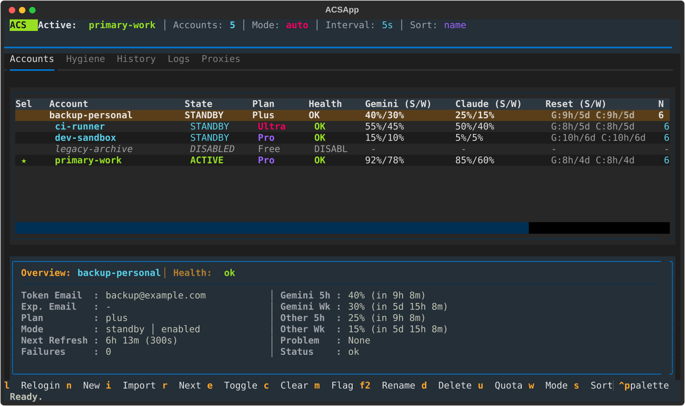

<div align="center">
  <p>
    <picture>
      <source media="(prefers-color-scheme: dark)" srcset="./assets/logo-dark.svg">
      <source media="(prefers-color-scheme: light)" srcset="./assets/logo-light.svg">
      
    </picture>
  </p>
  <p>Active-standby account manager and quota failover switcher for Antigravity CLI on Linux</p>
  <p>
    <a href="https://github.com/abstraction/antigravity-cli-switcher/actions"></a>
    <a href="https://github.com/abstraction/antigravity-cli-switcher"></a>
    <a href="./LICENSE"></a>
  </p>
</div>

---

<p align="center">
  
</p>

`antigravity-cli-switcher` (`acs`) manages multiple Google Antigravity CLI (`agy`) accounts on Linux. It tracks five-hour and weekly quota windows across Gemini and Claude model families, isolates OS keyring credentials to prevent active session corruption, and switches to healthy standby profiles automatically when quota runs out.

On Linux, `agy` stores OAuth credentials directly in the global FreeDesktop Secret Service via D-Bus (`service=gemini`, `username=antigravity`), backed by daemons like GNOME Keyring, KWallet, or KeePassXC. It does not store OAuth tokens in flat files, and it ignores `$HOME` overrides for credential resolution. When background processes or scripts query standby account quotas by overriding `$HOME`, `agy` still communicates with the shared system keyring over D-Bus and overwrites the active session token, breaking running terminal tasks.

`acs` resolves this through atomic keyring swap buffers, process locks, and real-time log monitoring:

* **Keyring swap buffers.** Standby account operations, background quota checks, and identity probes run inside temporary swap buffers. The active terminal token is restored immediately on completion or failure.
* **Automated log watch failover.** `acs watch` tails CLI session logs, detects quota exhaustion errors, and switches to the healthiest standby profile without dropping work.
* **Dual model-family tracking.** Tracks five-hour and weekly usage windows independently for Gemini and Claude model families.
* **Offline token verification.** Decodes JWT OAuth ID tokens locally to verify Google account email addresses, preventing token collisions and duplicate accounts without network calls.
* **Terminal dashboard and headless CLI.** Full-screen Textual interface for interactive management, plus sub-second headless commands for shell scripts and automated pipelines.

## Capabilities

* **OS keyring isolation.** Protects the active session credential while background processes check quotas or probe standby profiles.
* **Independent quota windows.** Evaluates `gemini-5h`, `gemini-weekly`, `other-5h`, and `other-weekly` quotas separately.
* **Configurable candidate ranking.** Selects standby accounts using `balanced`, `highest-short`, or `round-robin` strategies.
* **Interactive Textual TUI.** Five operational tabs (Accounts, Hygiene, History, Logs, Proxies) with keyboard navigation and modal dialogs.
* **Per-account proxy routing.** Assigns independent HTTP, HTTPS, or SOCKS5 proxies to individual accounts.
* **Credential hygiene engine.** Audits stored profiles, detects expired tokens, and flags file corruptions with automated repair commands.
* **Multi-backend quota polling.** Direct CloudCode HTTP engine (default, ~0.4s) avoids machine telemetry and keyring flapping. Native CLI wrapper executes inside isolated keyring buffers.
* **Headless automation.** Subcommands execute without loading the Textual framework, returning structured JSON via `--json` and standard exit codes.

## Requirements

* Linux (`x86_64` or `aarch64`)
* Python 3.10 or newer
* FreeDesktop Secret Service daemon (GNOME Keyring, KWallet, KeePassXC) and the `secret-tool` utility
* Antigravity CLI (`agy`) binary in `$PATH`
* `uv` (recommended) or `pip`

## Installation

Install using `uv` or `pip`:

```bash
# Using uv (recommended)
uv tool install -e . --force

# Using pip
pip install -e .
```

This installs the main command `antigravity-cli-switcher` and the short alias `acs`.

## Quick start

### 1. Initialize directory layout

```bash
acs init
```

This creates the manager root at `~/.antigravity-cli-switcher`.

### 2. Add accounts

Import your current active session profile:

```bash
acs import-current personal
```

Or run an interactive browser login for a new account:

```bash
acs login work
```

The tool launches the authentication flow in an isolated directory, extracts the token, decodes the email address, prompts for confirmation, and stores the profile.

### 3. Check status

```bash
acs list
acs status
acs whoami
```

### 4. Switch accounts manually

```bash
acs switch work
```

This updates the live `~/.gemini` profile directory and sets the active credential in the system keyring.

### 5. Start the terminal dashboard

```bash
acs
```

## Terminal dashboard

The dashboard provides a full-screen Textual interface for monitoring quotas, managing accounts, and auditing credentials. Launch it by running `acs` with no arguments, or via `acs dashboard`.

### Tabs

1. **Accounts (`1`).** Table displaying account name, active indicator, health badges (`OK`, `COOL`, `FAIL`, `INELIG`, `MISMAT`), Gemini and Claude five-hour and weekly usage percentages, reset timers, and failure counts. The detail panel shows account metadata, proxy settings, and cooldown status.
2. **Hygiene (`2`).** System audit view checking token expiration, profile files, keyring synchronization, and synthetic test tokens.
3. **History (`3`).** Audit log of switch events with timestamps, triggers (`manual`, `quota`, `log-watch`), and reasons.
4. **Logs (`4`).** Live tail of `manager.log` within the terminal.
5. **Proxies (`5`).** Table of configured HTTP and SOCKS5 proxies per account.

### Keybindings

| Key | Action |
|---|---|
| `1` - `5` | Switch to tab by index (Accounts, Hygiene, History, Logs, Proxies) |
| `Left` / `Right` or `[` / `]` | Navigate to previous or next tab |
| `Up` / `Down` or `j` / `k` | Navigate account rows |
| `Enter` or `a` | Activate the selected account |
| `r` | Rotate to the next available standby account |
| `l` | Re-authenticate the selected account via browser login |
| `n` | Add a new account via browser login |
| `i` | Import the current active profile |
| `e` | Enable or disable the selected account |
| `c` | Clear cooldown and broken status from the selected account |
| `m` | Mark the selected account broken with a cooldown |
| `F2` or `v` | Rename the selected account |
| `d` | Delete the selected account profile |
| `u` | Refresh quota usage for the selected account |
| `t` or `F5` | Refresh dashboard snapshot |
| `s` | Cycle sort order (name, state, health, usage-low, usage-high) |
| `w` | Toggle automatic switch mode (`auto` / `manual`) |
| `@` | Edit expected email address for the selected account |
| `p` | Open the switch policy editor modal |
| `q` | Quit the dashboard |

## Automated failover and log watch

The log watch daemon tails Antigravity CLI session logs, detects quota exhaustion, and switches to the healthiest standby account automatically.

### Running the watcher

Enable automatic switch mode and start the daemon:

```bash
acs switch-mode auto
acs watch
```

### Watcher behavior

1. **Log detection.** The daemon monitors `~/.gemini/logs/` for new output. It initializes at end-of-file on startup so previous errors do not trigger switches.
2. **Quota pattern match.** When `Individual quota reached` appears in the log, the watcher identifies the affected model family.
3. **Cooldown assignment.** The exhausted account receives a cooldown period (default 60 minutes) preventing immediate reselection.
4. **Candidate selection.** The switcher ranks remaining standby accounts using the active policy strategy and activates the best candidate.
5. **Post-switch hook.** You can execute a shell command upon rotation:

```bash
acs watch --on-rotate "notify-send 'Antigravity CLI' 'Switched account on quota exhaustion'"
```

6. **Session restart.** After failover, restart your `agy` process to read the new active credentials, then clear the restart marker:

```bash
acs ack-restart
```

You can also press `Y` inside the terminal dashboard to acknowledge the restart.

### Pre-execution verification

To verify that the active account is usable before starting a task in shell scripts:

```bash
# Ensure an active account is healthy and not in cooldown
acs ensure-active

# Ensure quota is available for a specific model family
acs ensure-active --family gemini
acs ensure-active --family claude
```

## Model family routing and policy

Different model families, Gemini and Claude/Other, track separate five-hour and weekly quota pools.

### Route resolution

To find or activate the best account for a specific model family:

```bash
# Check the recommended account for Gemini
acs resolve-route gemini

# Recommend account for Claude with strict family fallback
acs resolve-route claude --fallback-strategy strict-family

# Automatically switch to the recommended account
acs resolve-route gemini --force-switch
```

Available fallback strategies:
* `same-family-first` (default): Prioritizes remaining quota in the requested model family across standby accounts before trying an alternate family.
* `same-account-first`: Checks if the active account has quota for an alternate model family before switching to another account.
* `strict-family`: Refuses to switch to accounts that do not have quota for the requested model family.

### Switch policy configuration

Adjust auto-failover thresholds and candidate ranking:

```bash
# Set short-term usage threshold to 15% and candidate strategy to balanced
acs switch-policy --short-threshold 15.0 --candidate-strategy balanced

# Configure independent family thresholds
acs switch-policy --gemini-threshold 10.0 --other-threshold 20.0

# Set refresh failure threshold before marking an account failed
acs switch-policy --refresh-failure-threshold 3

# Configure family fallback strategy
acs switch-policy --family-fallback-strategy same-family-first
```

Candidate selection strategies:
* `balanced` (default): Evaluates both short-term quota usage and weekly headroom.
* `highest-short`: Prioritizes accounts with the greatest short-term quota remaining.
* `round-robin`: Rotates sequentially through eligible standby accounts.

## Quota refresh operations

`acs` supports three quota polling backends: `http` (default), `native`, and `auto`.

* **`http` (default)**: Direct HTTPS requests to CloudCode API (`daily-cloudcode-pa.googleapis.com`). Executes in ~0.4s. Does not send hardware identifiers (`canonical_device_id`, DMI product names) or telemetry to Google Clearcut (`play.googleapis.com`). Avoids OS keyring flapping for accounts with cached tokens.
* **`native`**: Executes `agy -p "/usage" --output-format json` wrapped in `_isolated_keyring_warmup`. Uses the official Go binary TLS fingerprint, but takes ~6.7s per invocation and transmits machine telemetry.
* **`auto`**: Attempts `native` first and automatically falls back to `http` if the CLI command fails or returns zero quota buckets.

### CLI commands and backend overrides

View or set the global quota backend:

```bash
# View current quota polling backend (http by default)
acs quota-backend

# Set quota polling backend globally (http / native / auto)
acs quota-backend http
```

Refresh quota usage using the active global backend or specify an explicit backend override:

```bash
# Refresh quota for a specific account (using global default or explicit backend)
acs refresh-usage work
acs refresh-usage work --backend native

# Refresh quota for the account next due according to policy
acs refresh-due
acs refresh-due --backend auto

# Sequentially refresh all accounts with delay between requests
acs refresh-all --delay-seconds 2.0 --skip-exhausted --skip-disabled
```

### Architecture and telemetry mechanics

Deep binary reconnaissance of the official `antigravity` (`agy`) Go binary revealed critical operational differences between `http` and `native` polling modes:

1. **Google Clearcut Telemetry**:
   - The `agy` CLI binary transmits operational metrics and event telemetry to Google Clearcut at `https://play.googleapis.com/log`.
   - Polling via `native` generates network calls to Google's telemetry servers on every invocation.
   - The `http` backend connects directly to CloudCode PA endpoints (`daily-cloudcode-pa.googleapis.com`), transmitting zero Clearcut event logs.

2. **Hardware Fingerprinting & Anti-Abuse Risk**:
   - On startup, `agy` inspects `/sys/class/dmi/id/product_name` to read machine hardware metadata, calculates a persistent `canonical_device_id`, and attaches `InstanceUuid` and `antigravity_ide_installation_id` to its requests.
   - When running multi-account setups with standby profiles, sequential `native` polling (`acs refresh-all`) authenticates multiple distinct Google user accounts from the exact same hardware fingerprint within seconds.
   - Transmitting multiple user tokens linked to an identical hardware fingerprint creates an immediate anti-abuse red flag (sybil and account-sharing detection) at Google's security perimeter, increasing the risk of automated 403 ToS suspensions.
   - The `http` backend completely bypasses the CLI binary: it does not read DMI hardware metadata, does not compute device fingerprints, and attaches no hardware UUIDs.

3. **Dynamic User-Agent Resolution**:
   - Google CloudCode API validates client identification. Rather than hardcoding static version strings, the `http` backend queries the locally installed `agy` binary (`agy --version`) at runtime via `resolve_agy_binary`.
   - Requests include dynamic headers matching the installed runtime (e.g., `User-Agent: antigravity/1.2.16 linux/amd64` and `Accept: application/json`).

4. **Performance and Keyring Stability**:
   - `http` backend calls complete in ~0.4s per account, compared to ~6.7s for `native` subprocess execution.
   - `http` uses stored OAuth access tokens directly and refreshes them via Google token endpoints only when expired. For accounts with valid cached tokens, `http` requires zero D-Bus OS keyring operations, eliminating keyring flapping.

| Metric / Dimension | `http` (Default) | `native` | `auto` |
|---|---|---|---|
| **Speed** | ~0.4s per account | ~6.7s per account | ~6.7s native / ~0.4s fallback |
| **Clearcut Telemetry** | None | Sends to `play.googleapis.com/log` | Depends on executed backend |
| **Hardware Fingerprint** | None | Sends `canonical_device_id`, DMI ID | Depends on executed backend |
| **Multi-Account Abuse Risk** | Minimal | High (same hardware ID across accounts) | Medium |
| **TLS JA3 Fingerprint** | Python OpenSSL | Native Go `crypto/tls` | Go first, Python fallback |
| **OS Keyring Flapping** | None (with cached token) | Requires `_isolated_keyring_warmup` | Keyring warmup on native attempt |
| **Primary Use Case** | Production & multi-account setups | Single-account testing / JA3 checks | Fallback safety net |


## Proxy management

Configure per-account HTTP, HTTPS, or SOCKS5 proxies:

```bash
# Set proxy for an account
acs proxy-set work http://127.0.0.1:8080 --label "Corporate Proxy"

# List configured proxies
acs proxy-list

# Show proxy details for an account
acs proxy-show work

# Clear proxy configuration
acs proxy-clear work
```

## Credential hygiene and verification

The hygiene engine detects orphaned credentials, expired tokens, and profile corruptions.

```bash
# Audit accounts and keyring state
acs hygiene

# Audit and automatically repair corruptions or synthetic test entries
acs hygiene --fix

# Verify runtime usability across accounts
acs verify-accounts
```

## Migration from legacy directory

If migrating from an earlier setup using `~/.agy-cli-manager`:

```bash
# Preview changes without modifying files
acs migrate --dry-run

# Run migration, update shell aliases, and preserve backward-compatibility symlink
acs migrate --update-shell
```

The migration utility creates a timestamped backup archive of the legacy directory, transfers profiles and state to `~/.antigravity-cli-switcher`, sets up a symlink for legacy paths, and updates aliases in shell configuration files.

## Command reference

| Command | Description |
|---|---|
| `acs init` | Initialize manager directory structure and default state |
| `acs dashboard` | Open full-screen Textual dashboard |
| `acs status` | Display overview of active account, standbys, and switch state |
| `acs list` | List all saved account profiles |
| `acs current` | Display the name of the currently active account |
| `acs whoami [name]` | Show authenticated Google email and token identity |
| `acs models [name]` | List available models for an account |
| `acs login <name>` | Launch interactive browser login into an isolated profile |
| `acs import-current <name>` | Import active profile from `~/.gemini` into manager storage |
| `acs add <name>` | Add an account profile by copying an existing directory |
| `acs switch <name>` | Switch the active account profile |
| `acs switch-next` | Switch to the next standby account in round-robin order |
| `acs rotate` | Rotate to the next standby account and print target details |
| `acs ensure-active` | Verify active account health, switching away if broken or in cooldown |
| `acs resolve-route <family>` | Recommend or activate the best account for a model family |
| `acs switch-mode [mode]` | Get or set failover mode (`auto` or `manual`) |
| `acs switch-policy` | Configure failover thresholds and candidate strategies |
| `acs watch` | Tail session logs and auto-switch on quota exhaustion |
| `acs ack-restart` | Clear restart-required flag after restarting `agy` |
| `acs disable <name>` | Temporarily exclude an account from rotation |
| `acs enable <name>` | Re-include a disabled account in rotation |
| `acs mark-bad <name>` | Mark an account broken with a cooldown period |
| `acs clear-bad <name>` | Clear broken status and cooldown from an account |
| `acs rename <old> <new>` | Rename an account profile |
| `acs delete <name>` | Delete an account profile directory |
| `acs set-email <name> [email]` | Set or clear expected email address for verification |
| `acs quota-backend [backend]` | Get or set the global quota polling backend (`http`, `native`, `auto`) |
| `acs refresh-usage <name>` | Query quota metrics for an account |
| `acs refresh-due` | Refresh quota for accounts due by policy schedule |
| `acs refresh-all` | Sequentially refresh quota metrics for all accounts |
| `acs proxy-set <name> <url>` | Assign proxy URL to an account |
| `acs proxy-list` | List all account proxy assignments |
| `acs proxy-show [name]` | Display proxy settings for an account |
| `acs proxy-clear <name>` | Remove proxy assignment from an account |
| `acs hygiene` | Audit account storage, token validity, and keyring health |
| `acs verify-accounts` | Test authentication and runtime usability |
| `acs switch-history` | View recent account switch events and audit trail |
| `acs switch-runtime` | View switcher runtime state and cooldowns |
| `acs migrate` | Migrate profiles and configuration from legacy directory |

All inspection and switching commands accept `--json` for structured output.

## State directory layout

```text
~/.antigravity-cli-switcher/
├── accounts/
│   ├── account-a/
│   │   └── .gemini/        # Stored configuration for account-a
│   └── account-b/
│       └── .gemini/        # Stored configuration for account-b
├── runtime/
│   └── .gemini/            # Active account staged copy
├── logs/
│   └── manager.log         # Rolling action log
├── state.json              # Account metadata, quotas, policies, and health
└── manager.lock            # Process lock for safe concurrency
```

During an account switch, the switcher stages profile files from `accounts/<name>/.gemini` into `runtime/.gemini`, synchronizes them to the live `~/.gemini` directory, and updates the token in the FreeDesktop Secret Service keyring.

## Automation and scripting

All read and write commands return exit code 0 for success and non-zero on failure. Commands supporting `--json` emit machine-readable output suitable for shell scripts, cron jobs, and external automation:

```bash
# Get active account name in a script
ACTIVE=$(acs current --json | jq -r .active)

# Check if Gemini quota is above threshold
HEADROOM=$(acs status --json | jq -r '.accounts[] | select(.name == "'"$ACTIVE"'") | .usage_windows["gemini-5h"].value')

# Pre-execution wrapper in a build pipeline
if ! acs ensure-active --family gemini --json > /dev/null; then
  echo "No healthy Gemini accounts available."
  exit 1
fi
```
